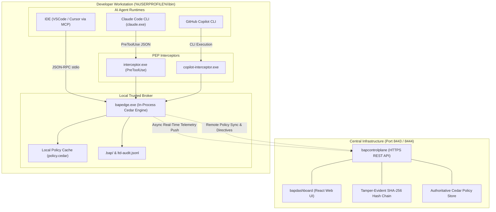

# Bounded Authority Plane (BAP) — Central MVP Enterprise Deployment Guide

This document provides complete, step-by-step operational instructions for deploying, configuring, verifying, and maintaining the **Bounded Authority Plane (BAP)** across enterprise fleets.

---

## Table of Contents
1. [Architecture & Component Overview](#1-architecture--component-overview)
2. [Prerequisites & System Requirements](#2-prerequisites--system-requirements)
3. [Distribution Layout & Package Inventory](#3-distribution-layout--package-inventory)
4. [Step 1: Deploying the Central Control Plane & Dashboards](#4-step-1-deploying-the-central-control-plane--dashboards)
   - [Option A: Windows High-Availability Supervisor](#option-a-windows-high-availability-supervisor)
   - [Option B: Linux Background Daemon Supervisor](#option-b-linux-background-daemon-supervisor)
   - [Option C: Linux Production Systemd Service](#option-c-linux-production-systemd-service)
5. [Step 2: 1-Click Developer Seat Onboarding](#5-step-2-1-click-developer-seat-onboarding)
6. [Step 3: Pre-Flight Diagnostics (`bap_doctor.bat`)](#6-step-3-pre-flight-diagnostics-bap_doctorbat)
7. [Step 4: Enterprise Phased Rollout Strategy](#7-step-4-enterprise-phased-rollout-strategy)
   - [Phase 1: Shadow / Audit Mode (Passive Observability)](#phase-1-shadow--audit-mode-passive-observability)
   - [Phase 2: Enforce Mode (Zero-Trust Hard Blocking)](#phase-2-enforce-mode-zero-trust-hard-blocking)
8. [Step 5: Launching AI Developer Agents Under Governance](#8-step-5-launching-ai-developer-agents-under-governance)
   - [Claude Code CLI Governance](#claude-code-cli-governance)
   - [GitHub Copilot CLI Governance](#github-copilot-cli-governance)
   - [IDE Model Context Protocol (MCP) Integration](#ide-model-context-protocol-mcp-integration)
9. [Step 6: Automated Headless Resiliency & Integrity Verification](#9-step-6-automated-headless-resiliency--integrity-verification)
10. [Step 7: Crash Recovery, Watchdogs, & Emergency Kill-Switches](#10-step-7-crash-recovery-watchdogs--emergency-kill-switches)
11. [Step 8: Troubleshooting Matrix & Operational FAQ](#11-step-8-troubleshooting-matrix--operational-faq)

---

## 1. Architecture & Component Overview

BAP enforces Zero-Trust execution boundaries over autonomous AI developer agents via a **Dual-PEP (Policy Enforcement Point)** topology:



### Key Components:
- **`bapcontrolplane`**: Central REST API and governance daemon. Manages agent registration, binary attestation, dynamic Cedar policy distribution, SHA-256 audit chaining, and fleet emergency kill-switches.
- **`bapdashboard`**: Standalone React/Vite dashboard (port 8444) and embedded Activity Cockpit (`inspector_v2.html` on port 8443).
- **`bapedge`**: Sub-2ms local execution broker with embedded AWS Cedar engine. Evaluates commands locally without blocking developer flow. Operates 100% offline if needed.
- **`interceptor`**: Claude Code `PreToolUse` lifecycle hook intercepting shell commands (`Bash`), file edits, and file viewing.
- **`copilot-interceptor`**: Interception shim for GitHub Copilot CLI.

---

## 2. Prerequisites & System Requirements

### Hardware Requirements
- **Control Plane Server**: 1 vCPU, 512 MB RAM, 10 GB Disk (supports 50,000+ daily audit events).
- **Developer Seat**: Negligible (< 15 MB disk space, < 25 MB RAM during execution bursts).

### Operating System Support
- **Windows**: Windows 10 / 11 / Server 2019+ (AMD64) — PowerShell 5.1+ or PowerShell 7+.
- **Linux**: Ubuntu 20.04+, Debian 11+, RHEL/Rocky 8+, Alpine 3.16+ (AMD64, ARM64) — glibc or musl.
- **macOS**: macOS 12 (Monterey) through macOS 15 (Sequoia) — Intel (AMD64) & Apple Silicon (ARM64).

### Network Requirements
- **Port 8443**: Inbound HTTPS to Control Plane (telemetry streaming, policy sync, attestation).
- **Port 8444**: Inbound HTTPS to React Dashboard.
- **Port 9090** *(Optional)*: BAP Gateway PEP for external banking/cloud API egress proxying.
- **Port 11434** *(Optional)*: Local Ollama / vLLM inference boundary.

---

## 3. Distribution Layout & Package Inventory

All pre-compiled, stripped (`-trimpath -ldflags "-s -w"`), tamper-checked binaries reside in the `dist/` directory:

```text
dist/
├── windows-amd64/
│   ├── bapcontrolplane.exe          # Central Control Plane daemon
│   ├── bapdashboard.exe             # React Dashboard binary
│   ├── bapedge.exe                  # Edge policy evaluation daemon
│   ├── bapgateway.exe               # Network egress PEP gateway
│   ├── interceptor.exe              # Claude Code PreToolUse hook
│   ├── copilot-interceptor.exe      # GitHub Copilot CLI interceptor
│   │
│   ├── claude-client/               # Canonical Developer Seat Package
│   │   ├── bapedge.exe              # Edge daemon
│   │   ├── interceptor.exe          # Claude hook
│   │   ├── run_claude_bap.bat       # Windows batch entrypoint
│   │   ├── run_claude_bap.ps1       # PowerShell multi-instance engine
│   │   ├── bap-config.json          # Endpoint & mode configuration
│   │   ├── policy.cedar             # Authoritative Cedar policy rules
│   │   └── schema.json              # Cedar entity schema
│   │
│   └── controlplane/                # Standalone Server Package
│       ├── bapcontrolplane.exe
│       ├── bap-config.json
│       ├── policy.cedar
│       └── schema.json
│
├── linux-amd64/                     # Linux 64-bit packages (matching layout)
├── linux-arm64/                     # Linux ARM64 / Graviton packages
├── darwin-amd64/                    # macOS Intel packages
├── darwin-arm64/                    # macOS Apple Silicon (M1/M2/M3/M4) packages
└── systemd/
    └── bapcontrolplane.service      # Production Linux systemd service unit
```

---

## 4. Step 1: Deploying the Central Control Plane & Dashboards

Deploy the central governance server on your shared security server, Kubernetes cluster, or developer workstation.

### Option A: Windows High-Availability Supervisor
For Windows servers or developer machines where the server must automatically restart if terminated:

```batch
# In project root or server package:
start_controlplane_supervisor.bat
```
- Spawns `bapcontrolplane.exe` with TLS on port 8443.
- Continuously monitors the server process. If killed in Task Manager or crashed, the supervisor **respawns it within 1 second**.
- Logs written to console. Press `Ctrl+C` to cleanly terminate both supervisor and server.

To start the standalone React Dashboard:
```batch
start /min bapdashboard.exe -port 8444 -controlplane https://localhost:8443
```

---

### Option B: Linux Background Daemon Supervisor
For Linux or macOS hosts running in headless environments:

```bash
# 1. Start Control Plane in background daemon mode:
./scripts/supervise_controlplane.sh start

# 2. Check live status and process ID:
./scripts/supervise_controlplane.sh status

# 3. View live server logs:
tail -f bap-controlplane-supervisor.log

# 4. Stop supervisor and server cleanly:
./scripts/supervise_controlplane.sh stop
```
- The supervisor runs as a detached background daemon (`nohup`).
- Automatically revives `bapcontrolplane` upon `kill -9` or abnormal exit.

---

### Option C: Linux Production Systemd Service
For production Linux servers managed by systemd:

1. Copy binaries and configuration:
   ```bash
   sudo mkdir -p /opt/bap
   sudo cp dist/linux-amd64/controlplane/bapcontrolplane /opt/bap/
   sudo cp policy.cedar schema.json bap-config.json /opt/bap/
   sudo useradd -r -s /bin/false bap
   sudo chown -R bap:bap /opt/bap
   sudo chmod 755 /opt/bap/bapcontrolplane
   ```

2. Install and enable the systemd unit:
   ```bash
   sudo cp dist/systemd/bapcontrolplane.service /etc/systemd/system/
   sudo systemctl daemon-reload
   sudo systemctl enable --now bapcontrolplane
   ```

3. Verify service health:
   ```bash
   sudo systemctl status bapcontrolplane
   curl -k https://localhost:8443/api/v1/health
   # Expected: {"status":"healthy","uptime_seconds":...}
   ```

---

## 5. Step 2: 1-Click Developer Seat Onboarding

To equip developer workstations with BAP governance without requiring manual file copying or environment path editing:

### Windows 1-Click Installation:
Run the client installer from the repository or distribution share:
```batch
install_bap_client.bat
```

**What the installer does automatically**:
1. Creates directory `%USERPROFILE%\bin` if it does not exist.
2. Deploys the 7 canonical files from `dist\windows-amd64\claude-client\`:
   - `bapedge.exe`
   - `interceptor.exe`
   - `run_claude_bap.bat`
   - `run_claude_bap.ps1`
   - `bap-config.json`
   - `policy.cedar`
   - `schema.json`
3. Idempotently adds `%USERPROFILE%\bin` to the Windows User `PATH` environment variable via the PowerShell .NET Environment API.
4. Updates the current Command Prompt session environment so commands are instantly available.

---

## 6. Step 3: Pre-Flight Diagnostics (`bap_doctor.bat`)

Immediately after onboarding (or before diagnosing issues), run the pre-flight health diagnostic:

```batch
bap_doctor.bat
```

### Diagnostic Output Example:
```text
===============================================================================
           BOUNDED AUTHORITY PLANE (BAP) - PRE-FLIGHT DOCTOR                   
===============================================================================
[*] Timestamp: 2026-09-16 17:35:00 | Host: DEV-WORKSTATION | User: Developer

[1/5] Core BAP Binaries & Client Tools...
  [PASS] bapedge.exe (Edge Daemon)           : C:\Users\User\bin\bapedge.exe (6.92 MB)
  [PASS] interceptor.exe (Claude Hook)       : C:\Users\User\bin\interceptor.exe (5.92 MB)
  [PASS] run_claude_bap.bat (Launcher)       : C:\Users\User\bin\run_claude_bap.bat

[2/5] AI Agent Runtime (Claude Code)...
  [PASS] Claude Code Executable              : C:\Users\User\.local\bin\claude.exe (v2.1.273)

[3/5] Control Plane Connectivity & TLS...
  [PASS] Control Plane (https://localhost:8443) : Reachable (TLS handshake latency: 853 ms)

[4/5] Cedar Policy Engine & Schema Invariants...
  [PASS] Cedar Policy File (policy.cedar)    : 122 lines loaded
  [PASS] Local Policy Evaluation             : Safe command authorized in 1 ms (< 1.5ms engine latency)

[5/5] Workspace & Recovery Custody...
  [PASS] Workspace .bap/ Isolation           : Isolated directory active (Zero root clutter)
  [PASS] Active BAP Transaction State        : Idle (No lingering transactions or lockouts)

===============================================================================
  DOCTOR STATUS: ALL 9/9 CHECKS PASSED (SYSTEM FULLY OPERATIONAL)
===============================================================================
```

---

## 7. Step 4: Enterprise Phased Rollout Strategy

To prevent disruption to engineering teams, BAP supports a two-phase rollout model:

### Phase 1: Shadow / Audit Mode (Passive Observability)
In Audit Mode, AI agents run with full telemetry. If an agent executes an action that violates Cedar policies (e.g. attempting to read a `.env` file or open external sockets), **the command is permitted to execute**, but:
1. A prominent warning is displayed to the developer.
2. An audit violation event is tagged as `shadow_deny` in telemetry.
3. SecOps monitors the Cockpit Radar to baseline legitimate developer tools before locking down.

To enable Audit Mode fleet-wide, update `bap-config.json`:
```json
{
  "controlplane_url": "https://localhost:8443",
  "gateway_url": "http://localhost:9090",
  "envoy_url": "http://localhost:10000",
  "trust_domain": "bap.internal",
  "environment": "development",
  "enforcement_mode": "audit"
}
```
*(Or set environment variable: `set BAP_ENFORCEMENT_MODE=audit`)*

---

### Phase 2: Enforce Mode (Zero-Trust Hard Blocking)
Once policy baselines are verified, switch `enforcement_mode` to `"enforce"`:
```json
{
  "controlplane_url": "https://localhost:8443",
  "enforcement_mode": "enforce"
}
```
In Enforce Mode:
- Every unauthorized command is blocked before execution (`exit 1`).
- Actionable suggestions are returned explaining what was blocked and how to remediate (e.g., using corporate identity tokens instead of private SSH keys).

---

## 8. Step 5: Launching AI Developer Agents Under Governance

### Claude Code CLI Governance
From any repository directory on the developer machine:
```batch
run_claude_bap.bat
```
*(Optionally pass prompts or arguments directly: `run_claude_bap.bat "Fix lint errors in main.go"`)*

**Lifecycle Execution Flow**:
1. Launcher acquires a transient mutex (<50ms critical section) to register session PID in `.claude/.bap-recovery.json`.
2. Checks port 8443; if `bapcontrolplane` is offline, automatically starts it in the background.
3. Modifies `.claude/settings.json` to attach `interceptor.exe` as the `PreToolUse` PEP hook.
4. Starts the background Session Guard Watchdog.
5. Launches `claude.exe`.
6. When Claude exits, unregisters session PID. If it was the last active session, restores original developer settings.

---

### GitHub Copilot CLI Governance
Route Copilot executions through `copilot-interceptor`:
```batch
copilot-interceptor.exe "git commit -m 'Initial commit'"
```
Forbidden commands (credential theft, evasive execution) trigger instant termination:
```text
[COPILOT BLOCKED BY POLICY] Denial triggered by: policy policy1
[CRITICAL SECURITY INVARIANT] Access to this resource is permanently prohibited by enterprise zero-trust policy.
```

---

### IDE Model Context Protocol (MCP) Integration
Configure `bapedge` in Cursor or VSCode (`settings.json` or `.cursor/mcp.json`):
```json
{
  "mcpServers": {
    "bap-governance": {
      "command": "bapedge.exe",
      "args": ["mcp", "--policy", "C:\\Users\\User\\bin\\policy.cedar"]
    }
  }
}
```
Exposes three standardized tools to the IDE:
- `bap_execute`: Evaluates and executes commands inside the governed boundary.
- `bap_status`: Reports active governance model, Cedar engine status, and identity.
- `bap_explain_policy`: Explains whether a command would be allowed and why.

---

## 9. Step 6: Automated Headless Resiliency & Integrity Verification

Run the automated headless test suite to verify system integrity, scaling, and fault tolerance without opening GUI popups:

```batch
run_resiliency_test.bat
```

For CI/CD pipelines requiring JSON output:
```batch
run_resiliency_test.bat -Json
```

### What the Suite Asserts:
1. **Supervisor Initialization**: Process spawning and TLS handshake.
2. **Auto-Restart Resiliency**: Kills `bapcontrolplane.exe` with `SIGKILL`/`taskkill`; asserts supervisor revives it in **< 1.5 seconds**.
3. **Scaling & Concurrency**: Launches 20 concurrent native policy decisions; asserts 100% pass rate with **~50ms average decision latency**.
4. **Offline-First Zero-Trust Invariant**: Shuts down Control Plane completely; asserts safe commands execute offline in < 200ms and workspace containment boundary strictly blocks directory traversal (`exit 1`).
5. **Reconnection & Resumption**: Re-establishes server and asserts active telemetry readiness.

---

## 10. Step 7: Crash Recovery, Watchdogs, & Emergency Kill-Switches

### Client Session Crash Recovery
If a developer closes Command Prompt without typing `/exit`, or if `claude.exe` crashes:
- The detached **Session Guard Watchdog** detects that 0 active sessions remain alive.
- It automatically restores `.claude/settings.json` from `.claude/settings.json.bap-mirror` and releases locks.
- If the watchdog itself was killed, the **very next invocation** of `run_claude_bap.bat` detects the orphan manifest and performs self-healing recovery before launching Claude.

### Emergency Fleet-Wide Kill-Switch
If an AI agent is compromised or an insider threat is detected, security operators can revoke authority instantly:

**Revoke a single session**:
```bash
curl -k -X POST https://localhost:8443/api/v1/control/revoke-session \
  -H "X-BAP-Admin-Token: admin123" \
  -H "Content-Type: application/json" \
  -d '{"session_id": "sess-agent-99"}'
```

**Trigger fleet-wide emergency kill-switch**:
```bash
curl -k -X POST https://localhost:8443/api/v1/control/kill-switch \
  -H "X-BAP-Admin-Token: admin123" \
  -H "Content-Type: application/json" \
  -d '{"active": true, "reason": "CISO Emergency Lockdown"}'
```
*Result*: Every edge agent immediately halts command execution (`exit 1`), writing persistent `kill_switch: true` to `.bap/policy-state.json`. Severing the host from the network cannot bypass the lockdown.

---

## 11. Step 8: Troubleshooting Matrix & Operational FAQ

| Symptom | Probable Root Cause | Resolution |
|---|---|---|
| `bapcontrolplane` is killed in Task Manager and does not restart | Server was launched as standalone background process without supervisor | Launch via `start_controlplane_supervisor.bat` (Windows) or `./scripts/supervise_controlplane.sh start` (Linux). |
| `Cannot overwrite variable PID because it is read-only` | Older version of `run_claude_bap.ps1` colliding with PowerShell automatic variable | Pull latest `run_claude_bap.ps1` from `dist/windows-amd64/claude-client/` (uses `$sessPid`). |
| `bap_doctor.bat` reports Control Plane listener warning | Server is not currently running | Expected during offline operation. Launch `start_inspector.bat` or `start_controlplane_supervisor.bat` if centralized telemetry is needed. |
| Claude Code executes commands without BAP interception | Claude launched via naked `claude.exe` instead of `run_claude_bap.bat` | Always launch via `run_claude_bap.bat`. Run `bap_doctor.bat` to verify hook status. |
| Forbidden command permitted with warning | `bap-config.json` has `enforcement_mode` set to `"audit"` | Change `"enforcement_mode"` to `"enforce"` in `bap-config.json` to enable Zero-Trust hard blocking. |
| Antivirus / EDR flags test scripts | Stale test script with heuristic strings present | Verify repository is updated. Ensure negative tests are only executed via `run_negative_testcases.bat`. |

