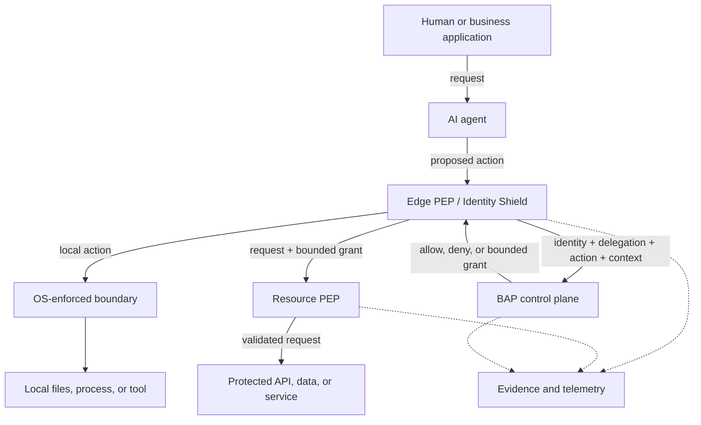

# 🛡️ Bounded Authority Plane (BAP)

### Identity, Zero Standing Privilege, and runtime authorization for AI agents

> **The human requested the work. The agent performed the action. The enterprise must be able to distinguish and prove both.**

BAP is an open-source reference implementation for controlling AI agents that can take actions on developer machines, servers, APIs, databases, MCP tools, and cloud services.

The core idea is simple:

- Give every agent its own identity.
- Keep the human identity separate from the agent identity.
- Record on whose behalf the agent is acting.
- Give the agent no permanent access to protected resources.
- Evaluate each protected action when it is requested.
- Issue only the authority needed for that action.
- Enforce that authority both where the agent runs and where the resource is accessed.
- Preserve evidence of the request, decision, action, and result.

**BAP does not treat a human credential as an agent identity, and it does not treat natural-language intent as authority.**

---

## Why BAP exists

AI agents are no longer limited to suggesting code. They can run commands, change files, call APIs, query data, and trigger workflows.

Most current integrations still make the agent use the human's credentials:

```text
Alice asks an agent to investigate an issue
                ↓
The agent decides which actions to take
                ↓
The resource records: "Alice performed the action"
```

That breaks the accountability model. The enterprise cannot reliably answer whether Alice performed the action herself, which agent acted, what the agent was asked to do, or what authority it had.

BAP separates the identities and reconnects them through explicit delegation:

```text
Human identity + Agent identity + Delegation + Requested action
                              ↓
                     Enterprise policy
                              ↓
                      Bounded authority
                              ↓
                 Enforcement at the resource
```

The human owns the request. The agent owns the execution. BAP preserves both.

---

## Zero Standing Privilege

In BAP, **ZSP means Zero Standing Privilege**.

An agent may run continuously and remain identifiable and observable without holding permanent access to production systems.

```text
Agent is running                         YES
Agent has an identity                    YES
Agent can be traced                      YES

Agent has permanent production access   NO
Agent stores a permanent database key    NO
Agent inherits the human's credentials   NO

Approved protected action
        ↓
Short-lived, narrowly scoped authority
        ↓
Action is enforced and recorded
        ↓
Authority expires or is consumed
```

Zero Trust is the security approach. Zero Standing Privilege is the authority outcome BAP is designed to achieve.

---

## The six questions BAP answers

Every protected agent action should answer:

1. **Who is the human or business process requesting the work?**
2. **Which agent or workload is performing it?**
3. **What exact action and resource are being requested?**
4. **Is the action allowed under current policy and context?**
5. **What minimum authority should be issued, and where will it be enforced?**
6. **Can the enterprise prove what was requested, decided, attempted, and completed?**

---

## Target architecture

Download the executive Level-0 architecture as an [editable SVG](visuals/ZSP_BAP_Target_Architecture_Level_0.svg) or [PNG](visuals/ZSP_BAP_Target_Architecture_Level_0.png).

BAP uses two enforcement points for protected actions:

- **Edge PEP:** intercepts the action where the agent runs.
- **Resource PEP:** independently validates the authority at the API, gateway, service, tool, or data boundary.

The control plane is not the second PEP. It provides identity registration, policy, authorization, grant issuance, governance, revocation, and evidence services to both enforcement points.



The resource PEP matters because a compromised agent can bypass a cooperative client library or local hook. A protected backend should not be reachable through an ungoverned path.

---

## Identity and authority are different

| Concept | Question answered | BAP treatment |
|---|---|---|
| Human identity | Who requested the work? | Authenticated by the enterprise identity provider and referenced by a delegation record. |
| Agent identity | Which logical agent is this? | Registered with owner, purpose, risk, allowed tools, environments, and lifecycle. |
| Workload identity | Which running instance is calling? | Cryptographically authenticated runtime identity; SPIFFE/SPIRE is one target integration. |
| Intent | Why was the work requested? | Context and evidence. Natural language alone never grants authority. |
| Bounded grant | What may this workload do now? | Short-lived, audience-bound, action- and resource-specific authority. |

The target grant model is:

```text
agent        = claude-code/instance-123
on_behalf_of = alice@company.com
action       = READ
resource     = trades/883
audience     = trade-api
expires      = now + 45 seconds
jti          = unique single-use identifier
request_hash = hash of the normalized request
```

The workload credential proves **who the caller is**. The BAP grant proves **what that caller may do right now**.

---

## Runtime flows

### Local developer action

1. A developer gives Claude Code, Copilot, or another agent a request.
2. The integration captures the request as session context.
3. Before a tool action, the edge evaluates the normalized operation against Cedar policy.
4. A denied action is stopped and recorded.
5. A permitted action runs through the available operating-system boundary and is recorded.

### Protected enterprise resource

1. The agent proposes a specific API, tool, or data operation.
2. BAP evaluates human delegation, agent/workload identity, requested action, resource, policy, environment, risk, and approvals.
3. If allowed, BAP issues a bounded grant.
4. The agent presents the grant to the resource PEP.
5. The resource PEP validates the grant, checks the requested resource, prevents replay, and forwards only the approved request.
6. The decision and result are correlated in the evidence trail.

---

## What this repository implements today

This repository is a working **engineering prototype and reference implementation**. It demonstrates the BAP control flow; it is not yet a production identity or authorization platform.

| Area | Current implementation |
|---|---|
| Agent integrations | Claude Code lifecycle and `PreToolUse` hook, Copilot command wrapper, MCP server, and Python SDK examples. |
| Local policy | Embedded Cedar evaluation with default-deny behavior and audit/enforce modes. |
| Intent context | Claude `UserPromptSubmit` capture correlated to the active session and subsequent events. |
| Sessions | Session lifecycle, heartbeats, revocation, and SQLite-backed session persistence. |
| Agent registry | In-memory agent/app/instance registry with development TOFU and production hash allow-list modes. |
| Workload identifier | A unique `spiffe://`-formatted identifier is assigned to enrolled instances. Native SPIFFE SVID issuance is a target integration. |
| Authority grants | Signed prototype JWT grants with scope checks and atomic one-time consumption. |
| Resource enforcement | `bapgateway` and an Envoy external-authorization demonstration enforce grants before a protected sample API. |
| Local execution boundary | Linux namespace isolation is implemented. Other platforms currently provide more limited process controls. |
| Policy distribution | Versioned Cedar bundles, digest validation, local cache, offline evaluation, and a persisted kill-switch state. |
| Evidence | Local and central SHA-256 hash chaining, session correlation, and live dashboards. External immutable anchoring is future work. |

Production adoption requires integration with enterprise human identity, cryptographic workload identity, hardened platform isolation, strongly authenticated control-plane APIs, production key management, durable replay state, and externally anchored evidence. See `ARCHITECTURE.md` for the target design and maturity boundaries.

---

## Repository components

| Component | Role |
|---|---|
| `bap-edge/` | Local policy evaluation, command execution, audit, session tooling, policy cache, and MCP server. |
| `cchook/` | Claude Code lifecycle and tool-request integration. |
| `copilot/` | Copilot command wrapper integration. |
| `python-agent/` | Python SDK and governed/ungoverned agent examples. |
| `bap-controlplane/` | Registration, prototype grants, policy distribution, sessions, revocation, audit ingestion, and dashboards. |
| `bap-gateway/` | Resource-side PEP reference implementation. |
| `envoy/` | Envoy external-authorization demonstration. |
| `dashboard/` | React governance dashboard. |

The existing inspector and React dashboard are the starting point for the BAP cockpit. The MVP cockpit will separate an executive coverage/risk view from SecOps, platform-operations, and agent-owner drill-downs.

---

## Quick start on Windows

From the repository root:

```batch
install_bap_client.bat
bap_doctor.bat
run_claude_bap.bat
```

To run the local control-plane supervisor:

```batch
start_controlplane_supervisor.bat
```

The synthetic fleet and incident endpoints are disabled by default. Use
`run_executive_demo.bat`, which starts the isolated demo with
`BAP_DEMO_MODE=1`. Do not enable demo mode against a production registry.

To run the resource-PEP demonstration, follow [`envoy/ENVOY_PODMAN_GUIDE.md`](envoy/ENVOY_PODMAN_GUIDE.md) or the gateway tests under `tests/`.

> The supplied scripts and certificates are intended for local development and demonstration. Review configuration, keys, authentication, network exposure, and platform controls before using them outside an isolated environment.

---

## Cedar policy example

BAP evaluates structured context with Cedar. The current prototype includes command context such as executable, arguments, full command, and workspace-escape detection.

```cedar
permit (
    principal,
    action == Action::"Execute",
    resource == Command::"CLI"
)
when {
    context.executable in ["git", "python", "go", "npm"] &&
    context.escapes_workspace == false
};

forbid (
    principal,
    action,
    resource
)
when {
    context.full_command like "*.env*" ||
    context.full_command like "*~/.aws*" ||
    context.full_command like "*.ssh*"
};
```

Command inspection is useful policy context, but it is not a replacement for operating-system isolation or resource-side enforcement.

---

## Design principles

1. **Human identity and agent identity remain distinct.**
2. **Identity is not authority.**
3. **Intent is context and evidence, not permission.**
4. **Agents have no standing privilege to protected resources.**
5. **Authority is bounded, short-lived, audience-specific, and preferably single-use.**
6. **Protected resources enforce authority independently.**
7. **Every decision and outcome produces correlated evidence.**
8. **BAP complements existing IdP, IGA, gateway, secrets, policy, and observability platforms.**

---

## Documentation

- [`ARCHITECTURE.md`](ARCHITECTURE.md) — target architecture, current implementation mapping, trust boundaries, and runtime patterns.
- [`API_GUIDE.md`](API_GUIDE.md) — current prototype API contract and authentication status.
- [`JIRA_STORIES.md`](JIRA_STORIES.md) — prioritized engineering backlog and production-readiness plan.
- [`MVP_DEPLOYMENT.md`](MVP_DEPLOYMENT.md) — local prototype deployment guide.
- [`PROJECT_MAP.md`](PROJECT_MAP.md) — repository navigation.

---

## One-sentence definition

**BAP gives every AI agent its own identity and only the authority it needs, when it needs it, while preserving the human delegation and evidence behind every action.**
