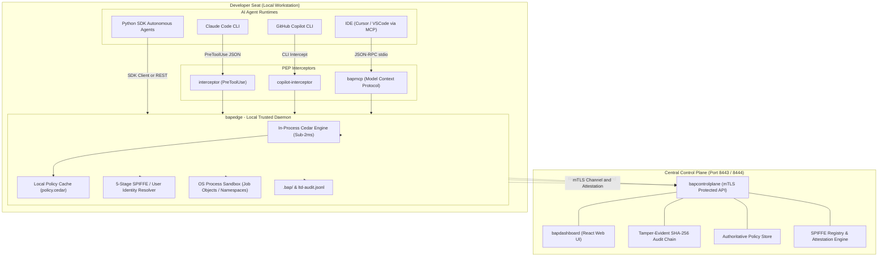

# 🛡️ Bounded Authority Plane (BAP)
### *Zero-Trust Security Posture (ZSP) for Autonomous AI Agents*

> **Open-Source AI Agent Sandboxing, Policy Enforcement, and Cryptographic Governance.**  
> *Empowering autonomous agents like Claude Code and GitHub Copilot to build software boldly — without giving them the keys to the kingdom.*

---

## 💡 The AI Developer Dilemma

We are witnessing an unprecedented shift in software engineering: **autonomous AI agents are no longer just generating text snippets; they are running terminal commands, editing production files, and interacting with network APIs.**

Tools like Claude Code, GitHub Copilot CLI, and agentic workflows operate directly on developer workstations. But this breakthrough velocity introduces a terrifying new attack surface:
- **Prompt Injections & Jailbreaks**: Malicious inputs disguised in code comments or web pages can hijack an agent to steal `~/.aws/credentials` or `.env` secrets.
- **Accidental Mass Destruction**: Hallucinations can lead to catastrophic deletions (`rmdir /s /q C:\` or `Remove-Item -Recurse`).
- **Data Exfiltration**: Rogue or compromised agents can open reverse TCP sockets or exfiltrate private source code via unauthorized network calls.

Until now, security teams faced an impossible tradeoff: **either cripple the AI agent's autonomy with rigid permission prompts on every command, or grant it unchecked access to developer machines.**

---

## 🎯 What is BAP?

**Bounded Authority Plane (BAP)** is an open-source, dual-layer governance kernel built from the ground up with a **Zero-trust Security Posture (ZSP)** at its heart.

BAP establishes a cryptographic boundary around AI agents. It acts as an intelligent, transparent gatekeeper that evaluates every shell invocation, file edit, and network call against declarative zero-trust policies in **less than 1.5 milliseconds** — completely offline, with zero disruption to developer flow.

### The ZSP Philosophy (Zero-Trust Security Posture)
1. **Never Trust, Always Verify**: Every tool invocation requested by an agent is intercepted and evaluated before process creation.
2. **Least Privilege by Default**: Agents only have authority within the active workspace root. Navigating outside is strictly forbidden.
3. **Fail-Secure Invariant**: If central servers go down or network partitions occur, BAP never fails open. Local cached policies continue protecting the host with 100% offline resilience.
4. **Transparent Governance**: Agents require **zero code modifications**. Standard developer toolchains (`git`, `python`, `npm`, `go`, `cargo`) work at native speed.

---

## 🏗️ Architecture: The Dual-PEP Model

BAP divides governance into an ultra-low latency **Client-Side Edge Broker** and a centralized **Governance Control Plane**:



### Core Components
- **`bapedge`**: The local trusted gatekeeper. Powered by an embedded pure-Go AWS Cedar evaluation engine, it resolves operator & SPIFFE identities, isolates executions in OS sandboxes, and evaluates rules in memory in sub-2ms.
- **`interceptor`**: Seamlessly integrates with Claude Code's native `PreToolUse` lifecycle hook without changing a single line of Claude's source code.
- **`copilot-interceptor`**: Wraps GitHub Copilot CLI executions to prevent defense evasion, shell escaping, and unauthorized credential access.
- **`bapmcp`**: First-class Model Context Protocol (MCP) server enabling Cursor, VS Code, and IDE agents to govern LLM tool invocations natively via JSON-RPC stdio.
- **`python-agent` (`bap_sdk`)**: Production-ready Python SDK client for programmatic governance of autonomous agent workflows, workers, and pipelines.
- **`bapcontrolplane`**: Central server managing the SPIFFE Workload Registry, binary attestation engine (TOFU in Dev, strict whitelisting in Prod), One-Time Code (OTC) enrollment, ephemeral On-Behalf-Of (OBO) JWT grants, and mutual TLS (mTLS) client verification with localhost-isolated admin controls.
- **`bapdashboard`**: Real-time visual observability cockpits (`inspector_v2.html` on 8443 and React UI on 8444) rendering live agent presence radars, allow/deny ratios, SPIFFE identity registries, and tamper-evident audit streams.

---

## ✨ Key Features

| Capability | How It Protects You |
|---|---|
| **SPIFFE Workload Identity** | Issues cryptographic, standard-compliant SVIDs (`spiffe://bap.internal/app/{app_id}/instance/{instance_id}`) binding every agent action to a provable workload identity. |
| **TOFU to Production Whitelisting** | Rapid developer iteration with automated **Trust-On-First-Use (TOFU)** hash locking, smoothly transitioning to strict cryptographic release whitelisting in production. |
| **mTLS & Secure Client Mesh** | Control Plane enforces Mutual TLS with pinned Corporate Root CAs, terminating unauthorized or unattested client connections at the transport layer. |
| **Binary Image Attestation** | Validates SHA-256 checksums of agent runtime binaries against signed baselines before issuing credentials or granting execution rights. |
| **Ephemeral Scoped OBO JWTs** | Mints short-lived (5-minute) On-Behalf-Of tokens with strict audience and role constraints. Agents never hold persistent cloud API keys or master credentials. |
| **AWS Cedar Policy Kernel** | Author human-readable, mathematically verifiable policies (e.g., allow `git` and `npm`, forbid access to `~/.aws`, `.env`, and raw sockets). |
| **Workspace Sandboxing** | Confines agent file operations strictly to the project directory. Directory traversals (`dir ..`, path escapes) are blocked automatically. |
| **OS-Level Process Isolation** | Sandboxes execution via Windows Job Objects and Linux namespaces/cgroups with execution timeouts and ANSI output sanitization. |
| **Native Model Context Protocol (MCP)** | Integrates directly with Cursor, Windsurf, and VS Code through standard MCP tools (`exec`, `read_file`, `list_directory`). |
| **Sub-2ms Decision Latency** | Evaluates policies in-process. Developers never feel lag or input stalls while pairing with AI. |
| **Offline-First Zero-Trust** | Network down? Airplane mode? `bapedge` enforces local cached policies without skipping a beat — failing secure by default. |
| **Progressive Enterprise Rollout** | Start in **Audit/Shadow Mode** to observe and baseline agent actions with zero disruption, then flip to **Enforce Mode** for strict Zero-Trust hard blocking. |
| **Multi-Instance Concurrency** | Run multiple Claude Code terminals across different repos simultaneously with zero lockouts or variable collisions. |
| **Self-Healing Session Guard** | A detached watchdog monitors Claude Code PIDs; if your terminal abruptly closes or crashes, your original environment settings are restored instantly. |
| **Tamper-Evident SHA-256 Audits** | Telemetry logs are cryptographically chained ($H_n = \text{SHA256}(H_{n-1} \parallel \text{Event})$). Any retrospective log tampering is immediately detected. |
| **Emergency Fleet Kill-Switch** | Instantly revoke a compromised session or isolate the entire fleet by SPIFFE ID or session token with a single API call from security operations. |
| **Zero-Dependency Portability** | Static Go binaries compiled with `CGO_ENABLED=0` for Windows, Linux (amd64/arm64), and macOS (Intel/Apple Silicon). |

---

## ⚡ Quickstart: Up and Running in 60 Seconds

### 1. One-Click Developer Installation (Windows)
From the repository root or release package:
```batch
install_bap_client.bat
```
*This deploys canonical client binaries to `%USERPROFILE%\bin` and automatically configures your User `PATH`.*

### 2. Pre-Flight Health Check
Verify your environment, binaries, Claude Code CLI, and Cedar engine:
```batch
bap_doctor.bat
```
*Returns a clean 5-domain diagnostic report confirming your workstation is ready.*

### 3. Launch Governed Claude Code
Launch Claude Code under BAP Zero-Trust protection:
```batch
run_claude_bap.bat
```
*All agent bash executions, file reads, and tool calls are now transparently governed!*

---

## 🛡️ Cedar Policies in Action

BAP uses declarative AWS Cedar policies. Here is how simple it is to enforce zero-trust rules:

```cedar
// 1. Allow standard developer toolchains within the workspace
permit (
    principal,
    action in [Action::"exec", Action::"tool_use"],
    resource
)
when {
    context.executable in ["git", "python", "go", "npm", "node", "mvn", "cargo"]
};

// 2. FORBID access to sensitive credentials and environment files
forbid (
    principal,
    action,
    resource
)
when {
    context.full_command like "*.env*" ||
    context.full_command like "*~/.aws*" ||
    context.full_command like "*.ssh*"
};

// 3. FORBID unconstrained network egress utilities
forbid (
    principal,
    action,
    resource
)
when {
    context.full_command like "*curl*" ||
    context.full_command like "*wget*" ||
    context.full_command like "*tcpclient*"
};
```

When an agent attempts a forbidden action (like reading `.env`), BAP halts execution and returns intelligent remediation guidance:
```text
[DENIED] Denial triggered by: policy policy2
[SUGGESTION] Direct access or tampering with .env credential files is strictly prohibited. Access required configuration via sandboxed environment variables or the corporate Secret Store.
```

---

## 🆔 Cryptographic Workload Identity & Attestation (SPIFFE)

Autonomous AI agents cannot be governed by traditional static API keys or network IPs alone. When multiple agents run locally or across distributed build nodes, security teams need to know **which exact agent binary executed which command, on behalf of which human developer.**

BAP implements the industry-standard **SPIFFE (Secure Production Identity Framework for Everyone)** architecture natively:

### 1. Attested SPIFFE Workload IDs
Every governed AI agent receives a verifiable SPIFFE ID conforming to the corporate trust domain:
```text
spiffe://bap.internal/app/{app_id}/instance/{instance_id}
```
*Example:* `spiffe://bap.internal/app/claude-code/instance/seat-eng-42`

### 2. Binary Image Attestation (SHA-256)
Before issuing credentials or authorizing high-privilege tool calls, BAP verifies the cryptographic integrity of the agent runtime:
- Computes the SHA-256 binary digest of the executable (e.g., `claude.exe`, `copilot.exe`).
- Validates the digest against authoritative corporate attestation baselines.
- Thwarts trojanized agent wrappers, modified binaries, and malicious prompt-injected shims.

### 3. Dual-Identity Binding (Operator + Workload)
BAP's 5-stage identity resolution engine binds every single tool execution to two distinct cryptographic entities:
1. **Operator Identity**: Authenticated human developer (`alice@corp.internal`) resolved via SSO tokens, OIDC, or `apiKeyHelper`.
2. **Workload Identity**: Attested AI agent instance (`spiffe://bap.internal/app/claude-code/instance/01J8K...`).

This guarantees **unforgeable non-repudiation**: audit logs prove not only that Alice approved a build, but exactly which Claude Code instance executed the build commands.

### 4. Ephemeral Scoped On-Behalf-Of (OBO) JWTs
- The control plane mints short-lived (5-minute TTL) On-Behalf-Of JWTs with tightly scoped audiences.
- The AI agent never touches raw cloud master keys, production tokens, or `.env` files.
- Tokens are injected just-in-time into isolated OS sandboxes and expire immediately after tool execution.

---

## 🔒 Secure Client Communication: TOFU to Enterprise Production

A central architectural requirement of BAP is that the **Control Plane only communicates with verified, cryptographically attested clients**. Unauthenticated tools, rogue scripts, or network attackers cannot query policy, inject telemetry, or mint credentials.

BAP solves the friction vs. security dilemma through an intentional, two-tier governance model:

### 1. Trust-On-First-Use (TOFU) in Development
Developer workstations require high velocity. Forcing engineers to pre-register new binary hashes on every local SDK tweak or tool update creates friction.
- **Development Profile (`types.ProfileDev`)**: BAP enables **Trust-On-First-Use (TOFU)**. On first contact, the control plane records and pins the agent runtime's SHA-256 binary hash (`agent.EnrolledBinaryHash`).
- **Tamper Lockdown**: Once enrolled, the hash is permanently anchored. If malware or an untrusted process modifies the binary, injects a shim, or swaps the executable, BAP immediately halts execution:
  ```text
  [ATTESTATION FAILURE] binary hash mismatch with enrolled development hash:
  got: a1b2c3d4... (modified) | expected: e5f6a7b8... (enrolled)
  ```

### 2. Strict Cryptographic Whitelisting in Production
In production pipelines (CI/CD build runners, Kubernetes pods, automated workflow daemons), **TOFU is explicitly disabled**:
- **Production Profile (`types.ProfileProd`)**: Every binary must be pre-declared in an authoritative cryptographic whitelist (`AllowedBinaryHashes`).
- **Zero-Tolerance Gate**: If an unattested or unlisted binary requests authorization or attempts to connect, the control plane rejects it instantly:
  ```text
  [SECURITY REJECTION] unauthorized binary image hash in production: deadbeef...
  ```
- All production binaries must be signed and promoted through enterprise Release Engineering pipelines.

### 3. Mutual TLS (mTLS) & Pinned CA Verification
- **Bidirectional Handshake**: Both `bapcontrolplane` and connecting clients (`bapedge`, standalone `bapdashboard`) can enforce mutual TLS (`-client-cert`, `-client-key`, and `-ca-cert`).
- **Transport-Layer Dropping**: Any client connection lacking a valid certificate signed by the corporate BAP Root CA (`bap-root-ca.crt`) is terminated at the TLS handshake before reaching application logic.
- **One-Time Code (OTC) Enrollment**: Developer workstation onboarding uses single-use, cryptographically random OTC tokens (`/api/v1/enroll/otc`) that expire upon first redemption, eliminating replay attacks.

### 4. Gated Administrative Isolation (`localhost`-Only by Default)
- **Localhost Shielding**: Administrative endpoints (global kill-switches, policy reloads, session revocations) are bound strictly to `localhost` (`127.0.0.1`) by default (`allowRemoteAdmin = false`).
- **File-Secured Admin Bearer**: Admin actions require high-entropy bearer credentials persisted in `.bap-admin-token` with strict POSIX/NTFS file access permissions (`0600`).
- **Remote Admin Gating**: Opening admin APIs across networks requires explicit operator flags, mTLS verification, and strict origin validation (`BAP_ALLOWED_ORIGINS`).

---

### 🛡️ Dev vs. Production Governance Matrix

| Governance Dimension | Local Development (`ProfileDev`) | Enterprise Production (`ProfileProd`) |
|---|---|---|
| **Binary Attestation** | **TOFU (Trust-On-First-Use)**: Auto-pins on first run, locks against modification | **Strict Cryptographic Whitelist**: Only pre-signed CI/CD release hashes permitted |
| **Transport Layer** | Local TLS (`-tls-auto`) / Loopback HTTPS | **Enforced mTLS**: Bidirectional verification with pinned Corporate Root CA |
| **Client Enrollment** | Self-service One-Time Codes (OTC) or developer identity | Pre-provisioned SVIDs and enterprise certificate enrollment |
| **Cedar Policy Mode** | **Audit / Shadow Mode**: Telemetry baselining with zero breakage | **Strict Enforce Mode**: Real-time Zero-Trust hard blocking of unauthorized calls |
| **Admin API Access** | Local loopback only (`127.0.0.1`) with file-secured admin token | Isolated management VPC / ingress gateway with SSO & hardware-backed mTLS |
| **Workload Credentials** | Short-lived OBO JWTs with automatic developer refresh | Ephemeral 5-minute scoped OBO JWTs restricted to specific resource ARNs |

---

## 📊 Live Observability & Dashboards

BAP provides dual visibility cockpits for developers and security teams:

- **Activity Inspector Cockpit** (`https://localhost:8443/inspector_v2.html`): Zero-dependency single-file HUD with a real-time agent presence radar, allow/deny ratios, live telemetry logs, and instantaneous session kill-switches.
- **Enterprise React Dashboard** (`https://localhost:8444/dashboard/`): Modern administrative interface for fleet-wide policy management, binary attestation tracking, and cryptographic audit chain verification.

To start the Control Plane with auto-restart supervision:
- **Windows**: `start_controlplane_supervisor.bat`
- **Linux**: `./scripts/supervise_controlplane.sh start`

---

## 🧪 Headless Automated Resiliency Suite

Verify system integrity, auto-restart capabilities, concurrency scaling, and offline fail-secure boundaries headlessly:

```batch
run_resiliency_test.bat
```
*(Optionally pass `-Json` for machine-readable CI/CD pipeline assertions.)*

---

## 🗺️ Project Documentation

- 📖 **[Central MVP Deployment Guide](MVP_DEPLOYMENT.md)** — Step-by-step enterprise deployment, seat onboarding, and operator manual.
- 📋 **[JIRA Product Backlog & Stories](JIRA_STORIES.md)** — Comprehensive user stories, acceptance criteria, and future enhancement roadmap.
- 🏛️ **[System Architecture Reference](ARCHITECTURE.md)** — In-depth architectural design, trust boundaries, identity models, and storage engine.
- 📡 **[API Specification](API_GUIDE.md)** — Complete OpenAPI/REST contract for Control Plane and Edge CLI interfaces.
- 🗺️ **[Project Navigation Map](PROJECT_MAP.md)** — Index of all repository modules, directories, and assets.

---

## 🤝 Join the Open-Source Movement

Autonomous AI agents are transforming engineering velocity. But without foundational security, enterprise adoption will stall under risk and fear.

**BAP is built to make autonomous agents safe, trustworthy, and auditable.**

We welcome contributors, security researchers, and AI toolchain builders! Feel free to open issues, submit pull requests, or start a discussion.

*Licensed under the Apache License 2.0. Built with security, speed, and developer joy at heart.*

