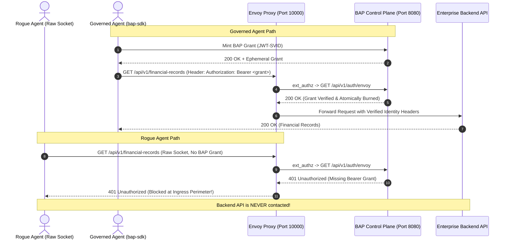

# BAP Option 1: Envoy Proxy Ingress PEP on Podman / Docker

## 1. Executive Context: Why Option 1 vs Option 3?

In enterprise environments, deploying security software encounters two distinct realities:

| Evaluation Dimension | Option 3: Pure-Go Native PEP (`bapgateway.exe`) | Option 1: Cloud-Native Envoy Proxy on Podman |
| :--- | :--- | :--- |
| **Primary Environment** | **Developer Laptops & Windows Desktops** | **Linux Servers, Kubernetes, OpenShift, Cloud VMs** |
| **Corporate Approval Friction** | Introducing a new unvetted `.exe` into a locked-down corporate laptop fleet can take **2+ months of Infosec review**. | `docker.io/envoyproxy/envoy` is an **industry-standard, pre-approved container image** in virtually every corporate container registry. |
| **Runtime Dependencies** | **Zero dependencies**: Pure standard library Go binary, runs instantly out-of-the-box. | Requires a container engine (**Podman** or **Docker**) with host networking. |
| **Demonstration Reliability** | **100% deterministic**: Never breaks on Windows laptops, no container daemon, hypervisor, or port bridge issues. | Depends on local container engine state (WSL2, Podman machine, rootless bridge). |
| **Role in BAP** | **Default Integrated Demo**: Integrated directly into `demo_cio_interactive.bat` and automated tests. | **Optional Standalone Showcase**: Demonstrates cloud-native readiness on Linux/Podman without risking the main demo. |

> [!IMPORTANT]
> **Separation of Concerns**: Option 1 is kept completely standalone in the `envoy/` directory. It shares the same BAP Control Plane authorization logic as Option 3, but running or skipping Option 1 will **never** impact or break your primary Windows CIO demo.

---

## 2. Architecture: How Envoy Enforces BAP Grants



---

## 3. How to Turn On Envoy with Podman (Step-by-Step)

### Prerequisites
- **Podman** (recommended) or **Docker**.
- **Python 3.10+**.
- **BAP Control Plane** running on port `8080`.

---

### Step 1: Start the BAP Control Plane
Ensure `bapcontrolplane` is active on port 8080:
```bash
# Windows
.\bap-controlplane\bapcontrolplane.exe -port 8080

# Linux / WSL
./bap-controlplane/bapcontrolplane -port 8080
```
Verify health:
```bash
curl http://localhost:8080/api/v1/health
```

---

### Step 2: Launch the Envoy Proxy Container

#### On Linux / WSL:
```bash
cd envoy
chmod +x run_envoy_podman.sh stop_envoy_podman.sh demo_envoy_podman.sh
./run_envoy_podman.sh
```

#### On Windows (PowerShell / Command Prompt):
```cmd
cd envoy
run_envoy_podman.bat
```

The script will automatically:
1. Detect `podman` (or fallback to `docker`).
2. Map `host.containers.internal:host-gateway` so the container can reach your host on port 8080.
3. Mount `envoy.yaml` read-only.
4. Bind Envoy's listener to host port `10000`.

---

### Step 3: Run the Standalone Demonstration

Execute the Python demonstration script:
```bash
# Windows
python demo_envoy.py

# Or 1-click batch:
demo_envoy_podman.bat

# Linux / macOS
python3 demo_envoy.py

# Or 1-click shell:
./demo_envoy_podman.sh
```

#### What You Will See:
1. **Scenario 1 (Rogue Agent)**:
   - Rogue agent sends a raw HTTP request without a BAP grant.
   - Envoy's `ext_authz` filter drops the request with **HTTP 401 Unauthorized**.
   - Server header shows `Server: envoy`.
2. **Scenario 2 (Governed Agent)**:
   - Governed agent uses `bap-sdk` to acquire an ephemeral grant.
   - Envoy passes the grant to `/api/v1/auth/envoy`.
   - Control plane validates the signature and burns the grant.
   - Envoy forwards the request to the upstream service and returns **HTTP 200 OK** with `x-envoy-upstream-service-time`.
3. **Scenario 3 (Replay Attack)**:
   - Attacker attempts to reuse the same token.
   - Envoy drops the request with **HTTP 403 Forbidden** because the single-use grant was destroyed.

---

### Step 4: Tear Down the Container

When you are done testing:
```bash
# Linux / WSL
./stop_envoy_podman.sh

# Windows
stop_envoy_podman.bat
```

---

## 4. Troubleshooting & Networking Details

### Issue 1: Container cannot reach `host.containers.internal`
- **Root Cause**: On older versions of Podman on Linux, `host.containers.internal` may not resolve automatically.
- **Solution**:
  Use Linux host networking mode instead:
  ```bash
  podman run -d --name bap-envoy-pep --network=host \
    -v $(pwd)/envoy.yaml:/etc/envoy/envoy.yaml:ro,Z \
    docker.io/envoyproxy/envoy:v1.31-latest \
    envoy -c /etc/envoy/envoy.yaml
  ```
  In `envoy.yaml`, change `host.containers.internal` to `127.0.0.1`.

### Issue 2: SELinux Permission Denied on `envoy.yaml`
- **Root Cause**: Red Hat Enterprise Linux / Fedora enforce SELinux confinement on container volume mounts.
- **Solution**: The `run_envoy_podman.sh` script automatically appends the `:Z` flag (`-v $(pwd)/envoy.yaml:/etc/envoy/envoy.yaml:ro,Z`) which configures the SELinux container label.

### Issue 3: Port 10000 Already in Use
- **Solution**: Modify `port_value: 10000` in `envoy.yaml` and update the port mapping in `run_envoy_podman.sh` (e.g., `-p 10001:10001`).

---

## 5. Summary: Dual-Option Strategy

```
┌────────────────────────────────────────────────────────────────────────┐
│                   BAP GATEWAY PEP DUAL STRATEGY                        │
├───────────────────────────────────┬────────────────────────────────────┤
│ Option 3: bapgateway.exe          │ Option 1: Envoy Proxy on Podman    │
├───────────────────────────────────┼────────────────────────────────────┤
│ • 100% Pure Go standard library   │ • Standard Cloud-Native Container  │
│ • No Podman/Docker required       │ • Pre-approved in corporate hubs   │
│ • Instant <5ms startup on Windows │ • Matches K8s / Istio architecture │
│ • Safe, reliable, uncrashable     │ • Dedicated standalone showcase    │
│ • Runs in demo_cio_interactive.bat│ • Runs via envoy/demo_envoy.py     │
└───────────────────────────────────┴────────────────────────────────────┘
```

